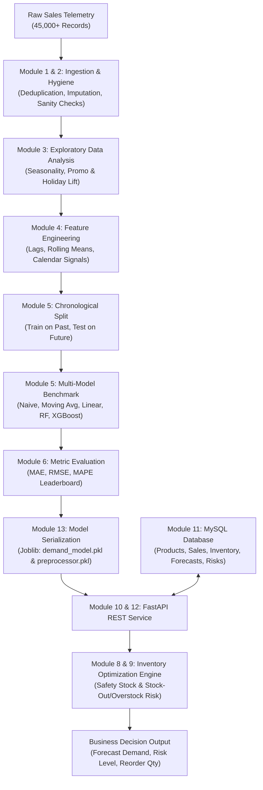

# 📈 Retail Sales Demand Forecasting & Inventory Optimization System

An end-to-end, production-grade Machine Learning and MLOps system that analyzes multi-store historical sales data, forecasts future product demand, assesses inventory risk (stock-out vs overstock), and automatically calculates optimal reorder quantities.

Built using **Python 3.12**, **Scikit-learn**, **XGBoost**, **FastAPI**, **MySQL 8.0**, **SQLAlchemy**, **Pytest**, and **Docker**.

---

## 🎯 Executive Summary & Objectives

Modern retail organizations lose millions annually from two opposite inventory failures:
1. **Stock-Outs**: Running out of stock during peak promotional or seasonal demand leads to lost revenue, dissatisfied customers, and permanent brand churn.
2. **Overstocking**: Excessive holding of slow-moving inventory traps working capital, elevates warehousing holding costs, and causes depreciation/spoilage.

This system bridges the gap between **predictive machine learning** and **inventory operations**:
- Predicts future product demand per store with ~10.7% MAPE using gradient-boosted trees.
- Dynamically estimates safety stock buffers based on lead times and promotional velocity.
- Evaluates active stock positions in real-time, categorizing risk as `Stock-Out Risk`, `Normal Stock`, or `Overstock Risk`.
- Calculates exact mathematical replenishment quantities ($Q = \max(\text{Required Stock} - \text{Current Inventory}, 0)$).
- Exposes full CRUD and prediction capabilities through a RESTful FastAPI service connected to MySQL.

---

## 🏗️ Architecture & End-to-End Workflow



---

## 📂 Project Directory Structure

```text
Sales_Forecast/
├── dataset/
│   ├── raw/
│   │   └── sales_data.csv             # Raw retail transaction telemetry (45,615 rows)
│   └── processed/
│       └── cleaned_sales.csv          # Sanitized dataset (duplicates & errors purged)
├── notebooks/
│   ├── 01_data_understanding.ipynb    # Ingestion audit & statistical overview
│   ├── 02_data_cleaning.ipynb         # Data hygiene & imputation steps
│   ├── 03_eda.ipynb                   # Trends, seasonality & promotional uplift
│   ├── 04_feature_engineering.ipynb   # Leakage-free lag & rolling features
│   ├── 05_model_training.ipynb        # Chronological train/test split & fitting
│   └── 06_model_evaluation.ipynb      # Leaderboard, justification & saving
├── src/
│   ├── __init__.py
│   ├── data_loader.py                 # Module 1: Ingestion & structural audit
│   ├── data_cleaning.py               # Module 2: Data hygiene pipeline
│   ├── eda.py                         # Module 3: Exploratory data analysis
│   ├── feature_engineering.py         # Module 4: Feature store & inference generator
│   ├── forecasting.py                 # Module 5: 5 model architectures & pipelines
│   ├── evaluation.py                  # Module 6: MAE/RMSE/MAPE & leaderboard
│   ├── inventory.py                   # Module 8 & 9: Optimization & risk engine
│   ├── generate_dataset.py            # Synthetic dataset generator
│   ├── seed_50_items.py               # Seeds 50 products + 250 inventory positions
│   └── seed_sales_forecasts.py        # Seeds 1250 sales + 250 forecasts + 250 risks
├── models/
│   ├── demand_model.pkl               # Serialized best ML model (XGBoost Regressor)
│   └── preprocessor.pkl               # Serialized Scikit-learn ColumnTransformer
├── api/
│   ├── __init__.py
│   ├── main.py                        # FastAPI application entrypoint & lifespan
│   ├── schemas.py                     # Pydantic v2 validation contracts
│   └── routes.py                      # REST endpoints & ML/DB integration
├── database/
│   ├── __init__.py
│   ├── database.py                    # SQLAlchemy session engine (MySQL + SQLite fallback)
│   ├── models.py                      # SQLAlchemy ORM database models
│   └── crud.py                        # Database CRUD repository layer
├── sql/
│   ├── schema.sql                     # PostgreSQL DDL script (reference)
│   ├── schema_mysql.sql               # MySQL 8.0 DDL script with indexes
│   └── analysis.sql                   # Real-world business analytical queries
├── tests/
│   ├── __init__.py
│   ├── test_data.py                   # Pytest: DataLoader and DataCleaner tests
│   ├── test_forecasting.py            # Pytest: Feature engineering & split tests
│   ├── test_inventory.py              # Pytest: Safety stock, reorder, risk tests
│   └── test_api.py                    # Pytest: FastAPI endpoint & integration tests
├── reports/
│   ├── model_comparison.csv           # Empirical model leaderboard
│   └── figures/                       # High-resolution analytical charts
│       ├── 01_temporal_sales_trends.png
│       ├── 02_category_sales_analysis.png
│       ├── 03_store_region_analysis.png
│       ├── 04_promotion_holiday_impact.png
│       ├── 05_top_low_products.png
│       └── 06_model_comparison_metrics.png
├── requirements.txt                   # Pinned production Python dependencies
├── .env                               # Active environment credentials (git-ignored)
├── .env.example                       # Environment configuration template
├── .gitignore                         # Standard git ignore definitions
├── Dockerfile                         # Production container image specification
├── docker-compose.yml                 # Multi-container orchestration (API + MySQL)
└── README.md                          # Comprehensive documentation & guide
```

---

## 🚀 COMPLETE RUN COMMANDS — Step by Step

> Run every command from the **project root** directory:
> `c:\10k\data science projects\Sales_Forecast`

---

### ⚙️ STEP 0 — Clone & Setup

```bash
# 1. Clone the repository
git clone https://github.com/hemanthmikkie/Sales_Forecast.git

# 2. Open the project folder
cd Sales_Forecast

# 3. Create a virtual environment
python -m venv venv

# 4. Activate virtual environment (Windows)
venv\Scripts\activate

# 4. Activate virtual environment (Linux / macOS)
source venv/bin/activate

# 5. Upgrade pip
pip install --upgrade pip

# 6. Install all required packages
pip install -r requirements.txt

# 7. Copy environment config template
cp .env.example .env
```

Edit your local, git-ignored `.env` file and set your MySQL credentials there. Never put real credentials in this README or commit them.
```env
DB_USER=root
DB_HOST=localhost
DB_PORT=3306
DB_NAME=sales_forecast
```

---

### 📊 STEP 1 — Generate Dataset

```bash
# Generate 45,615 realistic retail sales records
python src/generate_dataset.py
```

Expected output:
```
[Dataset] Generated 45615 records saved to dataset/raw/sales_data.csv
```

---

### 🧹 STEP 2 — Load & Inspect Data (Module 1)

```bash
# Load raw data and display structural audit
python src/data_loader.py
```

Expected output:
```
[DataLoader] Successfully loaded 45,615 records from 'dataset/raw/sales_data.csv'
Dataset Shape: 45,615 rows x 11 columns
Duplicate Records: 15
```

---

### 🔧 STEP 3 — Clean Data (Module 2)

```bash
# Run full data cleaning pipeline
python src/data_cleaning.py
```

Expected output:
```
[DataCleaner] Cleaned dataset saved separately at: 'dataset/processed/cleaned_sales.csv'
Initial Records: 45,615
Cleaned Records: 45,600
```

---

### 📉 STEP 4 — Exploratory Data Analysis (Module 3)

```bash
# Generate all EDA charts into reports/figures/
python src/eda.py
```

Expected output:
```
[EDA] Saved: reports/figures/01_temporal_sales_trends.png
[EDA] Saved: reports/figures/02_category_sales_analysis.png
[EDA] Saved: reports/figures/03_store_region_analysis.png
[EDA] Saved: reports/figures/04_promotion_holiday_impact.png
[EDA] Saved: reports/figures/05_top_low_products.png
```

---

### ⚡ STEP 5 — Feature Engineering (Module 4)

```bash
# Run feature engineering standalone check
python src/feature_engineering.py
```

Expected output:
```
Feature Engineered DataFrame shape: (45600, 27)
Columns: ['Store_ID', 'Product_ID', ..., 'Rolling_Mean_30']
```

---

### 🤖 STEP 6 — Train Models & Evaluate (Module 5 & 6)

```bash
# Train all 5 models, generate leaderboard, save best model
python src/evaluation.py
```

Expected output:
```
[Forecaster] Chronological split at date: 2025-12-30
  Train set: 36,442 rows
  Test set:   9,148 rows
[Forecaster] Training Linear Regression...
[Forecaster] Training Random Forest Regressor (n_estimators=100)...
[Forecaster] Training XGBoost Regressor...

============================================================
 MODEL PERFORMANCE LEADERBOARD (Empirical Validation)
============================================================
              Model Name    MAE    RMSE  MAPE (%)
           XGBoost Regressor   7.95   11.53     10.72   ← WINNER
    Random Forest Regressor   8.51   12.58     11.40
          Linear Regression  10.35   14.24     15.77
    Moving Average (7-Day)   17.54   25.60     22.87
   Naive Forecast (Lag-1)    21.17   32.29     27.21
============================================================

SELECTED MODEL: XGBoost Regressor
[Evaluator] Comparison table saved to 'reports/model_comparison.csv'
[Forecaster] Best model 'XGBoost Regressor' saved to 'models/demand_model.pkl'
[Forecaster] Preprocessor saved to 'models/preprocessor.pkl'
```

---

### 🗄️ STEP 7 — Setup MySQL Database (Module 11)

Make sure MySQL 8.0 is running, then:

```bash
# Option A: Let SQLAlchemy auto-create tables on first API start (recommended)
# Tables are created automatically when the FastAPI app starts

# Option B: Run MySQL DDL script manually
mysql -u root -p sales_forecast < sql/schema_mysql.sql
```

---

### 🌱 STEP 8 — Seed MySQL with Sample Data

```bash
# Seed 50 products + 250 inventory positions (50 products × 5 stores)
python src/seed_50_items.py
```

Expected output:
```
[Database] Successfully connected to MySQL database ('sales_forecast').
Products: 40 newly inserted, 10 updated/verified.
Inventory: Seeded/Updated 250 stock positions across stores S01-S05.
Total Products in Database:  50
Total Inventory Records:    250
Successfully seeded 50 products and inventory into MySQL!
```

```bash
# Seed 1250 sales + 250 forecasts + 250 inventory risk records
python src/seed_sales_forecasts.py
```

Expected output:
```
[1/3] Inserting Sales records ...
    -> 1250 sale records staged.
[2/3] Inserting Forecast records ...
    -> 250 forecast records staged.
[3/3] Inserting Inventory Risk records ...
    -> 250 inventory risk records staged.

DATABASE VERIFICATION:
  - Total Products in Database:  50
  - Total Inventory Records:    250
  - Total Sales Records:       1250+
  - Total Forecast Records:     250+
  - Total Risk Records:         250+
Successfully seeded Sales, Forecasts & Inventory Risks!
```

---

### 🧪 STEP 9 — Run All Tests (Module 14)

```bash
# Run full pytest test suite with verbose output
python -m pytest tests/ -v
```

Expected output:
```
============================= test session starts =============================
collected 25 items

tests/test_api.py::test_get_health                         PASSED  [  4%]
tests/test_api.py::test_get_sales                          PASSED  [  8%]
tests/test_api.py::test_post_sales_valid                   PASSED  [ 12%]
tests/test_api.py::test_post_sales_invalid_product         PASSED  [ 16%]
tests/test_api.py::test_post_sales_invalid_negative_units  PASSED  [ 20%]
tests/test_api.py::test_get_inventory                      PASSED  [ 24%]
tests/test_api.py::test_post_forecast_ml_prediction        PASSED  [ 28%]
tests/test_api.py::test_get_forecast_by_product            PASSED  [ 32%]
tests/test_api.py::test_get_inventory_risk_evaluation      PASSED  [ 36%]
tests/test_api.py::test_post_reorder_replenishment         PASSED  [ 40%]
tests/test_api.py::test_get_products                       PASSED  [ 44%]
tests/test_api.py::test_get_product_by_id                  PASSED  [ 48%]
tests/test_api.py::test_get_product_not_found              PASSED  [ 52%]
tests/test_data.py::test_data_loader_inspection            PASSED  [ 56%]
tests/test_data.py::test_data_cleaning_pipeline            PASSED  [ 60%]
tests/test_data.py::test_data_loader_missing_file_error    PASSED  [ 64%]
tests/test_forecasting.py::test_feature_engineering_calculations PASSED  [ 68%]
tests/test_forecasting.py::test_chronological_split        PASSED  [ 72%]
tests/test_forecasting.py::test_model_evaluator_metrics    PASSED  [ 76%]
tests/test_forecasting.py::test_inference_feature_extractor PASSED  [ 80%]
tests/test_inventory.py::test_safety_stock_calculation     PASSED  [ 84%]
tests/test_inventory.py::test_reorder_quantity_deficit     PASSED  [ 88%]
tests/test_inventory.py::test_reorder_quantity_zero_when_sufficient PASSED  [ 92%]
tests/test_inventory.py::test_overstock_risk_detection     PASSED  [ 96%]
tests/test_inventory.py::test_negative_input_validation    PASSED  [100%]

========================= 25 passed in ~10s ==========================
```

---

### 🌐 STEP 10 — Start FastAPI Server (Module 10 & 12)

```bash
# Start the FastAPI application with hot-reload
uvicorn api.main:app --host 0.0.0.0 --port 8000 --reload
```

Expected startup output:
```
[Database] Successfully connected to MySQL database ('sales_forecast').
[Startup] Initializing database tables...
[Startup] Checking master data (seeding only if products table is empty)...
[Startup] Loading ML demand forecasting artifacts...
[API] Loaded ML model 'XGBoost Regressor' successfully.
[Startup] Application ready — visit http://localhost:8000/docs
INFO:     Uvicorn running on http://0.0.0.0:8000
```

Open in browser: **http://localhost:8000/docs**

---

### 🔌 STEP 11 — Test API Endpoints (curl examples)

```bash
# 1. Health check — verify API, DB, and model are live
curl -X GET "http://localhost:8000/health"

# 2. List all products in catalog
curl -X GET "http://localhost:8000/products"

# 3. Get a single product
curl -X GET "http://localhost:8000/products/P101"

# 4. List sales records (latest 5)
curl -X GET "http://localhost:8000/sales?limit=5"

# 5. Record a new sale
curl -X POST "http://localhost:8000/sales" \
     -H "Content-Type: application/json" \
     -d '{"date":"2026-10-05","store_id":"S01","product_id":"P101","units_sold":45,"discount":10.0,"promotion":1}'

# 6. View current inventory (all stores)
curl -X GET "http://localhost:8000/inventory"

# 7. View inventory for one store
curl -X GET "http://localhost:8000/inventory?store_id=S01"

# 8. Generate ML demand forecast
curl -X POST "http://localhost:8000/forecast" \
     -H "Content-Type: application/json" \
     -d '{"product_id":"P102","store_id":"S01","forecast_date":"2026-11-01","unit_price":89.5,"discount":15.0,"promotion":1,"holiday":0,"lag_1":52.0,"rolling_mean_7":58.5}'

# 9. Get forecast history for a product
curl -X GET "http://localhost:8000/forecast/P102?store_id=S01"

# 10. Evaluate inventory risk
curl -X GET "http://localhost:8000/inventory-risk/P101?store_id=S01&lead_time_days=2"

# 11. Place a reorder
curl -X POST "http://localhost:8000/reorder" \
     -H "Content-Type: application/json" \
     -d '{"product_id":"P101","store_id":"S01","reorder_quantity":150,"supplier_notes":"Weekend stock replenishment"}'
```

---

### 🐳 STEP 12 — Run with Docker (Module 15)

```bash
# Build and start both MySQL + FastAPI containers
docker compose up --build

# Run in background (detached mode)
docker compose up --build -d

# View container logs
docker compose logs -f

# View only API logs
docker compose logs -f api_service

# Stop all containers
docker compose down

# Stop and remove all volumes (wipes DB data)
docker compose down -v
```

After Docker starts:
- **API Swagger UI**: http://localhost:8000/docs
- **MySQL port**: 3306

---

### 📊 STEP 13 — Verify MySQL Data Directly

```bash
# Quick Python database check
python -c "
from database.database import SessionLocal
from database.models import Product, Inventory, Sale, Forecast, InventoryRisk
db = SessionLocal()
print('Products       :', db.query(Product).count())
print('Inventory rows :', db.query(Inventory).count())
print('Sales          :', db.query(Sale).count())
print('Forecasts      :', db.query(Forecast).count())
print('Inventory Risks:', db.query(InventoryRisk).count())
db.close()
"
```

Expected output:
```
Products       : 50
Inventory rows : 250
Sales          : 1250+
Forecasts      : 250+
Inventory Risks: 250+
```

---

### 🔄 STEP 14 — Git Commands

```bash
# Check project status
git status

# View commit history
git log --oneline

# Pull latest changes
git pull origin main

# Push your changes
git add -A
git commit -m "your message here"
git push origin main
```

---

## 🧩 Module-by-Module Summary

### Module 1 — Data Loading (`src/data_loader.py`)
- Loads raw CSV, audits shapes, dtypes, null values, duplicates, and statistics.

### Module 2 — Data Cleaning (`src/data_cleaning.py`)
- Removes duplicates, imputes missing values, validates domains, detects outliers (3×IQR).
- Saves cleaned data to `dataset/processed/cleaned_sales.csv`.

### Module 3 — Exploratory Data Analysis (`src/eda.py`)
- **Key Findings**:
  - Weekend sales surge: **+35%** over midweek.
  - Promotional uplift: **+60.13%** demand boost.
  - Holiday uplift: **+62.57%** demand boost.
  - Generates 6 charts saved to `reports/figures/`.

### Module 4 — Feature Engineering (`src/feature_engineering.py`)
- **Revenue**:
  $$\text{Revenue} = \text{Units\_Sold} \times \text{Unit\_Price} \times \left(1 - \frac{\text{Discount}}{100}\right)$$
- **Strict No-Leakage Lag Features**:
  - $\text{Lag}_1 = \text{shift}(1)$
  - $\text{Lag}_7 = \text{shift}(7)$
  - $\text{Lag}_{30} = \text{shift}(30)$
  - $\text{Rolling\_Mean}_7 = \text{shift}(1).\text{rolling}(7).\text{mean}()$
  - $\text{Rolling\_Mean}_{30} = \text{shift}(1).\text{rolling}(30).\text{mean}()$

### Module 5 & 6 — Demand Forecasting & Model Evaluation

| Model Name | MAE | RMSE | MAPE (%) | Rank |
| :--- | :---: | :---: | :---: | :---: |
| **XGBoost Regressor** | **7.95** | **11.53** | **10.72%** | **🥇 Winner** |
| Random Forest Regressor | 8.51 | 12.58 | 11.40% | 🥈 2 |
| Linear Regression | 10.35 | 14.24 | 15.77% | 🥉 3 |
| Moving Average (7-Day) | 17.54 | 25.60 | 22.87% | 4 |
| Naive Forecast (Lag-1) | 21.17 | 32.29 | 27.21% | 5 |

### Module 8 & 9 — Inventory Optimization (`src/inventory.py`)

$$\text{Safety Stock} = \max(5,\ \text{Forecast Demand} \times 0.20)$$
$$\text{Required Stock} = (\text{Forecast Demand} \times \text{Lead Time}) + \text{Safety Stock}$$
$$\text{Reorder Quantity} = \max(\text{Required Stock} - \text{Current Inventory},\ 0)$$

### Module 10, 11 & 12 — FastAPI + MySQL + REST API

| Endpoint | Method | Description |
|----------|--------|-------------|
| `/health` | GET | System, DB & model heartbeat |
| `/products` | GET | Full product catalog (50 items) |
| `/products/{id}` | GET | Single product by ID |
| `/sales` | GET | Paginated historical sales |
| `/sales` | POST | Record new sale transaction |
| `/inventory` | GET | Current stock levels by store |
| `/forecast` | POST | Generate ML demand forecast |
| `/forecast/{product_id}` | GET | Forecast history for a product |
| `/inventory-risk/{product_id}` | GET | Risk evaluation & reorder advice |
| `/reorder` | POST | Replenish inventory stock |

### Module 14 — Testing (`tests/`)
- **25 / 25 Pytest tests PASSING** — covers API, data, forecasting, and inventory modules.

### Module 15 — Containerization (`Dockerfile`, `docker-compose.yml`)
- MySQL 8.0 + FastAPI multi-container Docker stack.

---

## 📡 Sample API Responses

### GET /health
```json
{
  "status": "ok",
  "database_status": "connected",
  "active_model": "XGBoost Regressor",
  "timestamp": "2026-10-05T16:00:00Z"
}
```

### POST /forecast
```json
{
  "product_id": "P102",
  "store_id": "S01",
  "forecast_date": "2026-11-01",
  "predicted_demand": 64,
  "model_used": "XGBoost Regressor",
  "confidence_interval": "± 12 units (95% CI based on validation MAE)"
}
```

### GET /inventory-risk/P101
```json
{
  "product_id": "P101",
  "store_id": "S01",
  "current_inventory": 30,
  "forecast_demand": 78.0,
  "safety_stock": 15.6,
  "lead_time_days": 2,
  "required_stock": 171.6,
  "reorder_quantity": 142,
  "risk_level": "Stock-Out Risk",
  "recommendation": "High stock-out hazard! Urgent reorder of 142 units advised."
}
```

### POST /reorder
```json
{
  "product_id": "P101",
  "store_id": "S01",
  "reorder_quantity": 142,
  "previous_inventory": 30,
  "new_inventory": 172,
  "status": "CONFIRMED",
  "message": "Successfully reordered 142 units. Inventory balance updated from 30 to 172."
}
```

---

## 🎓 Technical Interview Highlights

1. **Why Chronological Split instead of Random Shuffle?**
   > *"In time-series demand forecasting, random shuffling causes temporal lookahead leakage because future demand signals bleed into training sets. A strictly chronological split (past 80% for training, future 20% for testing) mirrors real-world production forecasting."*

2. **How was Feature Leakage Prevented?**
   > *"Features like `Rolling_Mean_7` are computed using `shift(1).rolling(7).mean()`. Shifting by 1 before computing the window ensures the current day's target is never included in input features."*

3. **How does ML Connect to Financial ROI?**
   > *"Rather than stopping at MAE/RMSE, this system translates demand predictions into inventory decisions — factoring in lead times and safety stock to identify stock-out and overstock hazards in real-time and recommend exact reorder quantities."*

4. **Production Readiness:**
   > *"Complete separation of concerns: modular feature store, Scikit-learn pipelines fitted strictly on training data, Pydantic v2 schemas, persistent DB audits, 25 Pytest tests passing, and multi-container Docker deployment."*

---

## 🔗 GitHub Repository

```
https://github.com/hemanthmikkie/Sales_Forecast
```

---

## 📄 License
This project is open-source and licensed under the **MIT License**.
